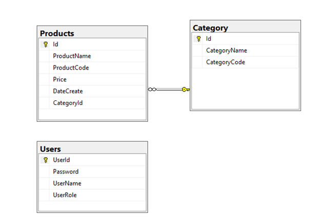

# ProductCRUD
Create an application using Windows Forms with .NET5/.NET6, C#, and ADO.NET (or Entity Framework Core). A MS SQL Server database will be created to persist the data and it will be used for reading and managing data.
A part of ElectricStoreDB database. User role: Administrator = 1; Manager = 2; Staff = 3

 
Task 1. Design graphic user interface and project organize with 3-layer-architecture
1. (0.5 mark) Design login form includes UI controls for login function
2. (0.5 mark) Design management form, this form includes UI controls for CRUD actions with Products information. Note: the CategoryId/CategoryName will come from the Category table. Design a form that allows you to view the list of records, create a new item, update the existing item, and delete a specific record.
Task 2. Implement CRUD actions with GUI
3. (1 mark) Authentication function
If user with an Administrator role logs in successfully, save this information to a temporary parameter. All CRUD are required with authentication. In the case login unsuccessfully, display “Sorry, you are not allowed to access“
4. (2 mark) Check if login successfully, list all Products in the Products table.
5. (1 mark) Check if login successfully, search Product by ProductCode.
6. (1 mark) Check if login successfully, deletes the selected item with the confirmation then update the list of Product.
7. (2.5 marks) check if login successfully, add a new item (Product) with the requirements:
- The CategoryId/CategoryName will come from the Category table (you can use ComboBox UI control in this case)
- All fields are required.
- DateCreate in Create function will be automatically set today.
- DateCreate in Update function is not allow to change.
- Value for ProductCode is 4 characters, and all will be capital
- Value Price not allow <=0.
8. (1.5 marks) Check if login successfully, updates an existing item.